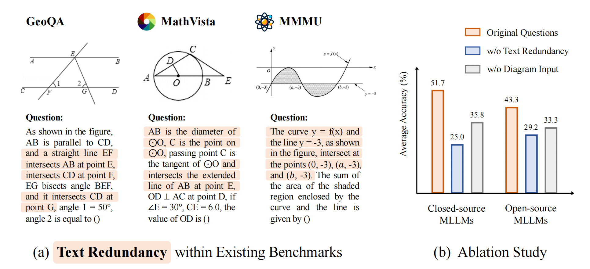
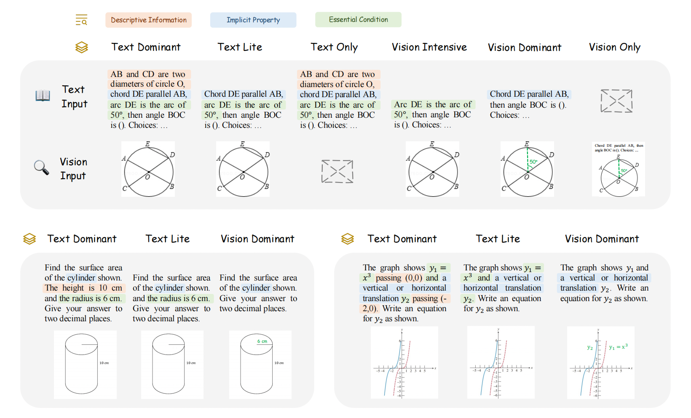
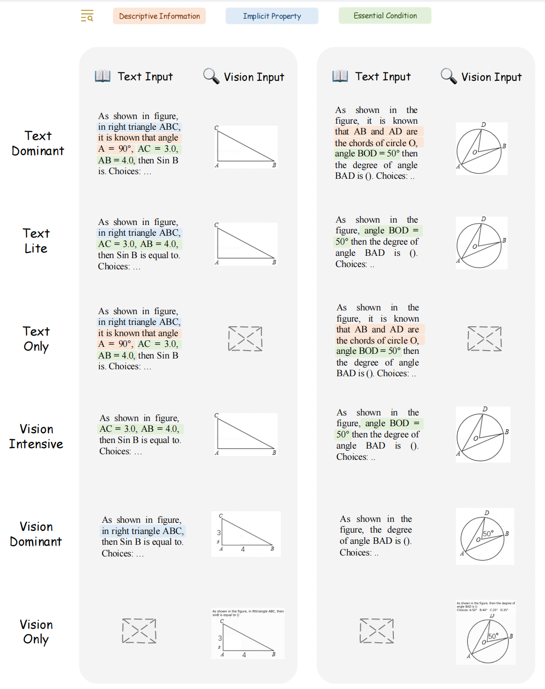
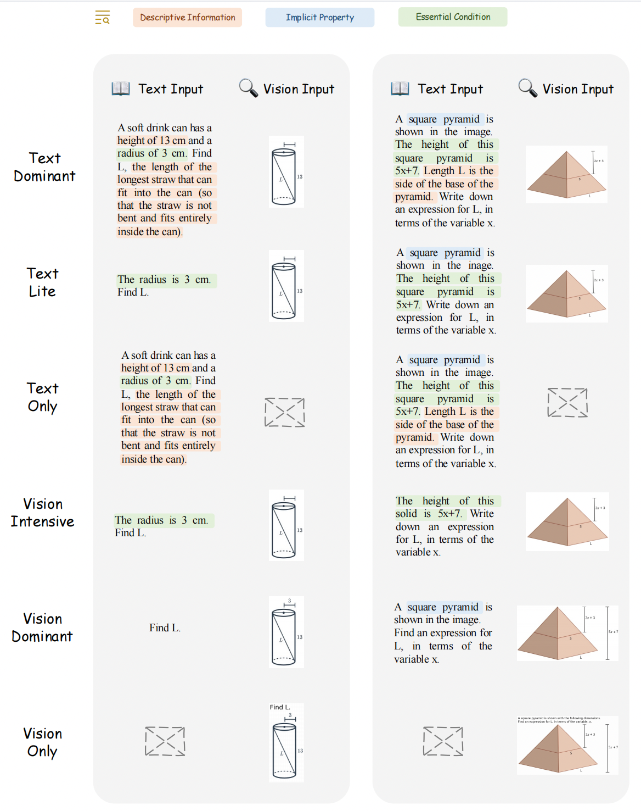
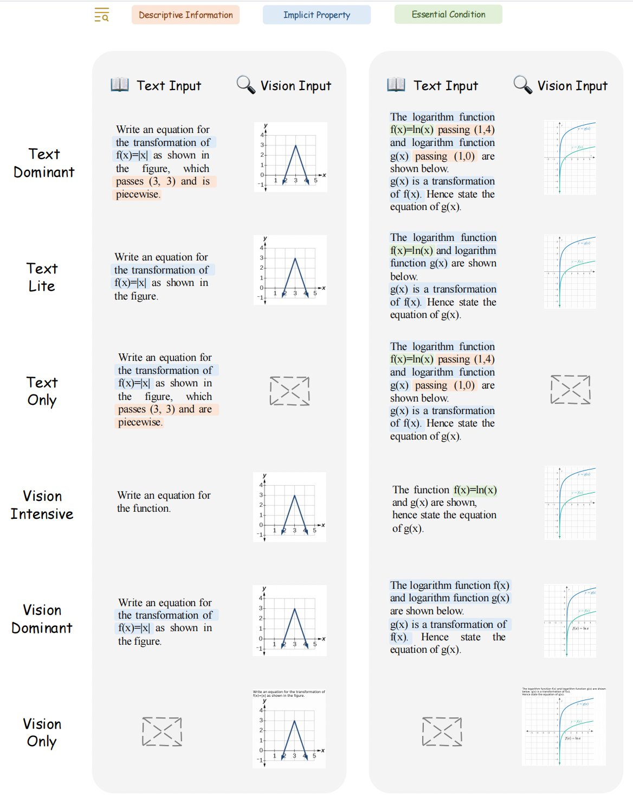

# MathVerse 🔥: Does Your Multi-modal LLM Truly See the Diagrams in Visual Math Problems?

 
 
 

 
 


Official repository for the paper "[MathVerse: Does Your Multi-modal LLM Truly See the Diagrams in Visual Math Problems?](https://arxiv.org/pdf/2403.14624.pdf)".

🌟 For more details, please refer to the project page with dataset exploration and visualization tools: [https://mathverse-cuhk.github.io/](https://mathverse-cuhk.github.io/).


[[🌐 Webpage](https://mathverse-cuhk.github.io/)] [[📖 Paper](https://arxiv.org/pdf/2403.14624.pdf)] [[🤗 Huggingface Dataset](https://huggingface.co/datasets/AI4Math/MathVerse)] [[🏆 Leaderboard](https://mathverse-cuhk.github.io/#leaderboard)] [[🔍 Visualization](https://mathverse-cuhk.github.io/#visualization)]


## 💥 News
- **[2024.09.23]** 🎉 MathVerse is officially supported by [VLMEvalKit](https://github.com/open-compass/VLMEvalKit) for very fast evalution 🚀
- **[2024.08.05]** The new official LLaVA model, [LLaVA-OneVision](https://llava-vl.github.io/blog/2024-08-05-llava-onevision/), adopt [MAVIS-Insruct](https://github.com/ZrrSkywalker/MAVIS) as training data 🔥, achieving new SoTA on MathVerse.
- **[2024.07.31]** 🎉 MathVerse is officially supported by [lmms-eval](https://github.com/EvolvingLMMs-Lab/lmms-eval) for very fast evalution 🚀
- **[2024.07.11]** 🔥 We release [MAVIS](https://github.com/ZrrSkywalker/MAVIS) to boost mathematical MLLMs, including two large-scale datasets, **MAVIS-Caption & Instruct** 📊, a vision encoder **Math-CLIP** 📐, and a math-specific MLLM, **MAVIS-7B** 🎓
- **[2024.07.01]** 🎉 MathVerse is accepted by ECCV 2024 🎉
- **[2024.03.22]** 🚀 We release the [arXiv paper](https://arxiv.org/pdf/2403.14624), the ***testmini*** set of MathVerse at [[🤗 Huggingface Dataset]](https://huggingface.co/datasets/AI4Math/MathVerse), and the [evaluation code](https://github.com/ZrrSkywalker/MathVerse?tab=readme-ov-file#evaluation)!


## 👀 About MathVerse

The capabilities of **Multi-modal Large Language Models (MLLMs)** in **visual math problem-solving** remain insufficiently evaluated and understood. We investigate current benchmarks to incorporate excessive visual content within textual questions, which potentially assist MLLMs in deducing answers without truly interpreting the input diagrams.

<p align="center">
     <br>
</p>

To this end, we introduce **MathVerse**, an all-around visual math benchmark designed for an equitable and in-depth evaluation of MLLMs. We meticulously collect 2,612 high-quality, multi-subject math problems with diagrams from publicly available sources. Each problem is then transformed by human annotators into **six distinct versions**, each offering varying degrees of information content in multi-modality, contributing to **15K** test samples in total. This approach allows MathVerse to comprehensively assess ***whether and how much MLLMs can truly understand the visual diagrams for mathematical reasoning.*** 

<p align="center">
     <br>
    Six different versions of each problem in <b>MathVerse</b> transformed by expert annotators.
</p>

In addition, we propose a **Chain-of-Thought (CoT) Evaluation strategy** for a fine-grained assessment of the output answers. Rather than naively judging True or False, we employ GPT-4(V) to adaptively extract crucial reasoning steps, and then score each step with detailed error analysis, which can reveal the intermediate CoT reasoning quality by MLLMs.


## 🚀 Evaluation with lmms-eval

We strongly recommand to use [lmms-eval](https://github.com/EvolvingLMMs-Lab/lmms-eval) for evaluating MathVerse, which is very efficient and convenient.

First install the package:
```bash
pip install lmms-eval
```
Then run by specifying $GPTAPI, $ModelType, $ModelPath, $Template, and $OutputPath:
```bash
export API_TYPE="openai"
export OPENAI_API_KEY="$GPTAPI"

python3 -m accelerate.commands.launch \
    --main_process_port=12347 \
    --num_processes=8 \
    -m lmms_eval \
    --model $ModelType \
    --model_args pretrained="$ModelPath,$Template" \
    --tasks mathverse_testmini \
    --batch_size 1 \
    --log_samples \
    --output_path $OutputPath/
```
Please refer to the guideline of [lmms-eval](https://github.com/EvolvingLMMs-Lab/lmms-eval) for setting your $ModelType, $ModelPath, and $Template.

You can also choose one problem version for evaluation by specifying `--tasks`, e.g., `--tasks mathverse_testmini_text_lite` or `--tasks mathverse_testmini_text_lite,mathverse_testmini_text_only`

We provide an example for evaluating LLaVA-OneVision:
```bash
export API_TYPE="openai"
export OPENAI_API_KEY="$GPTAPI"

python3 -m accelerate.commands.launch \
    --main_process_port=12347 \
    --num_processes=8 \
    -m lmms_eval \
    --model llava_onevision \
    --model_args pretrained="lmms-lab/llava-onevision-qwen2-7b-ov,conv_template=qwen_1_5,model_name=llava_qwen" \
    --tasks mathverse_testmini \
    --batch_size 1 \
    --log_samples \
    --output_path ./test/
```

## 💪 Evaluation by yourself

If your model type has not yet supported by lmms-eval, we also provide the code to derive the 'w/o' scores by yourself, which requires advanced LLMs (e.g., [ChatGPT/GPT-4](https://platform.openai.com/account/api-keys), or [Qwen-Max](https://help.aliyun.com/zh/dashscope/developer-reference/api-details)) to extract and match answers. The code 'CoT-E' scores will be released soon.

There are two steps for the evaluation of 'w/o' scores, where we prompt the ChatGPT/GPT-4 API as an example:

#### Step 1: Answer Extraction

```bash
pip install openai
cd evaluation

python extract_answer_s1.py \
--model_output_file PATH_TO_OUTPUT_FILE \
--save_file PATH_TO_ENTRACTION_FILE \
--cache \
--trunk_response 30 \
--save_every 10 \
--api_key GPT_API
```

Note that, step 1 is ***optional*** if your MLLM can directly output a clean answer for scoring.

#### Step2: Answer Scoring

```bash
python score_answer_s2.py \
--answer_extraction_file PATH_TO_ENTRACTION_FILE \
--save_file PATH_TO_SCORE_FILE \
--cache \
--trunk_response 30 \
--save_every 10 \
--api_key GPT_API
```

Note that, we recommend using ChatGPT/GPT-4 API for step 2 by default. By adding `--quick_match` in the command above, we also support a direct string matching between extracted answers and ground truths, which is faster but not accurate enough.

## 🏆 Leaderboard

### Contributing to the *testmini* Leaderboard

🚨 The [Leaderboard](https://mathverse-cuhk.github.io/#leaderboard) for the *testmini* set is continuously being updated, welcoming the contribution of your excellent MLLMs! ***Currently, we regard the 'w/o' scores without the CoT evaluation as the primary metric in MathVerse***, which is more cost-effective and saves time.

### Data Usage

We release the ***testmini*** set of MathVerse for benchmarking on the leaderboard, which contains *788 visual math problems* within two json files:

- [testmini.json](https://github.com/ZrrSkywalker/MathVerse/blob/main/data/testmini.json): **788*5** test samples for five main versions to ***calculate the overall score***, i.e., Text Dominant/Lite and Vision Intensive/Dominant/Only.
- [testmini_text_only.json](https://github.com/ZrrSkywalker/MathVerse/blob/main/data/testmini_text_only.json): **788*1** test samples for Text Only to ***ablate the visual diagram understanding capacity***.

You can download the dataset from the [🤗 Huggingface](https://huggingface.co/datasets/AI4Math/MathVerse) by the following command (make sure that you have installed [related packages](https://huggingface.co/docs/datasets/quickstart)):

```python
from datasets import load_dataset

dataset = load_dataset("AI4Math/MathVerse", "testmini")
dataset_text_only = load_dataset("AI4Math/MathVerse", "testmini_text_only")
```

Here are some examples of how to access the downloaded dataset:

```python
# print the first example on the testmini set
print(dataset["testmini"][0])
print(dataset["testmini"][0]['sample_index'])  # print the test sample id
print(dataset["testmini"][0]['problem_index'])  # print the unique problem id
print(dataset["testmini"][0]['problem_version'])  # print the problem version
print(dataset["testmini"][0]['question'])  # print the question text
print(dataset["testmini"][0]['query'])  # print the question query
print(dataset["testmini"][0]['answer'])  # print the answer
print(dataset["testmini"][0]['query_wo'])  # the input query for w/o scores
print(dataset["testmini"][0]['query_cot'])  # the input query for CoT evaluation scores
dataset["testmini"][0]['image']  # display the image

# print the first text-only example within the testmini set
print(dataset_text_only["testmini_text_only"][0])
```

We also provide the images in the PNG format. You can download and unzip them using the following commands:

```bash
cd data
wget https://huggingface.co/datasets/AI4Math/MathVerse/resolve/main/images.zip
unzip images.zip && rm images.zip
```

This step might be optional if you prefer to use the Hugging Face format of the data.

### Inference

First, please refer to the following two templates to prepare your result json files. 

- [output_testmini.json](https://github.com/ZrrSkywalker/MathVerse/blob/main/output_templates/output_testmini.json): the results of five problem versions in [testmini.json](https://github.com/ZrrSkywalker/MathVerse/blob/main/data/testmini.json)
- [output_testmini_text_only.json](https://github.com/ZrrSkywalker/MathVerse/blob/main/output_templates/output_testmini_text_only.json): the results of the Text-only version in [testmini_text_only.json](https://github.com/ZrrSkywalker/MathVerse/blob/main/data/testmini_text_only.json)

If you expect to evaluate the 'w/o' scores in the leaderboard, please adopt `query_wo` as the input for MLLMs, which prompts the model to output a direct answer. For CoT evaluation, we can utilize `query_cot` that motivates MLLMs to provide a step-by-step reasoning process. You are also encouraged to tune the optimal prompt for your own model.


## 📐 Dataset Examples

🖱 Click to expand the examples for six problem versions within three subjects</summary>

<details>
<summary>🔍 Plane Geometry</summary>

<p align="center">
     <br>
</p>
</details>

<details>
<summary>🔍 Solid Geometry</summary>

<p align="center">
     <br>
</p>
</details>

<details>
<summary>🔍 Functions</summary>

<p align="center">
     <br>
</p>
</details>


## 📈 Evaluation Results

Coming soon!

## :white_check_mark: Citation

If you find **MathVerse** useful for your research and applications, please kindly cite using this BibTeX:

```latex
@article{zhang2024mathverse,
  title={MathVerse: Does Your Multi-modal LLM Truly See the Diagrams in Visual Math Problems?},
  author={Zhang, Renrui and Jiang, Dongzhi and Zhang, Yichi and Lin, Haokun and Guo, Ziyu and Qiu, Pengshuo and Zhou, Aojun and Lu, Pan and Chang, Kai-Wei and Gao, Peng and others},
  journal={arXiv preprint arXiv:2403.14624},
  year={2024}
}
```

## 🧠 Related Work

Explore our additional research on **Vision-Language Large Models**, focusing on multi-modal LLMs and mathematical reasoning:

- **[MathVista]** [MathVista: Evaluating Mathematical Reasoning of Foundation Models in Visual Contexts](https://github.com/lupantech/MathVista)
- **[LLaMA-Adapter]** [LLaMA-Adapter: Efficient Fine-tuning of Language Models with Zero-init Attention](https://github.com/OpenGVLab/LLaMA-Adapter)
- **[LLaMA-Adapter V2]** [LLaMA-Adapter V2: Parameter-Efficient Visual Instruction Model](https://github.com/OpenGVLab/LLaMA-Adapter)
- **[ImageBind-LLM]** [Imagebind-LLM: Multi-modality Instruction Tuning](https://github.com/OpenGVLab/LLaMA-Adapter/tree/main/imagebind_LLM)
- **[SPHINX]** [The Joint Mixing of Weights, Tasks, and Visual Embeddings for Multi-modal LLMs](https://github.com/Alpha-VLLM/LLaMA2-Accessory/tree/main/SPHINX)
- **[SPHINX-X]** [Scaling Data and Parameters for a Family of Multi-modal Large Language Models](https://github.com/Alpha-VLLM/LLaMA2-Accessory/tree/main/SPHINX)
- **[Point-Bind & Point-LLM]** [Multi-modality 3D Understanding, Generation, and Instruction Following](https://github.com/ZiyuGuo99/Point-Bind_Point-LLM)
- **[PerSAM]** [Personalize segment anything model with one shot](https://github.com/ZrrSkywalker/Personalize-SAM)
- **[MathCoder]** [MathCoder: Seamless Code Integration in LLMs for Enhanced Mathematical Reasoning](https://github.com/mathllm/MathCoder)
- **[MathVision]** [Measuring Multimodal Mathematical Reasoning with the MATH-Vision Dataset](https://github.com/mathvision-cuhk/MathVision)
- **[CSV]** [Solving Challenging Math Word Problems Using GPT-4 Code Interpreter](https://wangk.org/publications/1_iclr2024_csv/)
