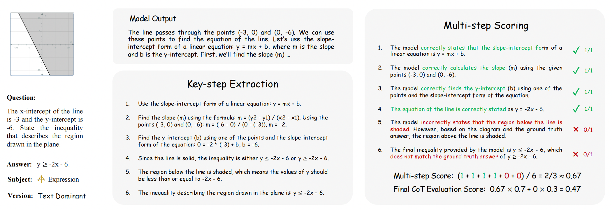

# MathVerse 🔥: Does Your Multi-modal LLM Truly See the Diagrams in Visual Math Problems?

 
 
 

 
 


Official repository for the paper "[MathVerse: Does Your Multi-modal LLM Truly See the Diagrams in Visual Math Problems?](https://arxiv.org/pdf/2403.14624.pdf)".

🌟 For more details, please refer to the project page with dataset exploration and visualization tools: [https://mathverse-cuhk.github.io/](https://mathverse-cuhk.github.io/).


[[🌐 Webpage](https://mathverse-cuhk.github.io/)] [[📖 Paper](https://arxiv.org/pdf/2403.14624.pdf)] [[🤗 Huggingface Dataset](https://huggingface.co/datasets/AI4Math/MathVerse)] [[🏆 Leaderboard](https://mathverse-cuhk.github.io/#leaderboard)] [[🔍 Visualization](https://mathverse-cuhk.github.io/#visualization)]


## 💥 News

- **[2024.03.22]** 🎉 **MathVerse** has been selected as 🤗 [***Hugging Face Daily Papers***](https://huggingface.co/papers/2403.14624)!
- **[2024.03.22]** 🚀 We release the [arXiv paper](https://arxiv.org/pdf/2403.14624) and some data samples in the [visualizer](https://mathverse-cuhk.github.io/#visualization).

## 📌 ToDo

- The *testmini* set of MathVerse will be released at [🤗 Huggingface](https://huggingface.co/datasets/AI4Math/MathVerse) in a week.
- Coming soon: *CoT Evaluation results*, evaluation tools, and the entire MathVerse dataset

## 👀 About MathVerse

The capabilities of **Multi-modal Large Language Models (MLLMs)** in **visual math problem-solving** remain insufficiently evaluated and understood. We investigate current benchmarks to incorporate excessive visual content within textual questions, which potentially assist MLLMs in deducing answers without truly interpreting the input diagrams.

<p align="center">
     <br>
</p>

To this end, we introduce **MathVerse**, an all-around visual math benchmark designed for an equitable and in-depth evaluation of MLLMs. We meticulously collect 2,612 high-quality, multi-subject math problems with diagrams from publicly available sources. Each problem is then transformed by human annotators into **six distinct versions**, each offering varying degrees of information content in multi-modality, contributing to **15K** test samples in total. This approach allows MathVerse to comprehensively assess ***whether and how much MLLMs can truly understand the visual diagrams for mathematical reasoning.*** 

<p align="center">
     <br>
    Six different versions of each problem in <b>MathVerse</b> transformed by expert annotators.
</p>

In addition, we propose a **Chain-of-Thought (CoT) Evaluation strategy** for a fine-grained assessment of the output answers. Rather than naively judging True or False, we employ GPT-4(V) to adaptively extract crucial reasoning steps, and then score each step with detailed error analysis, which can reveal the intermediate CoT reasoning quality by MLLMs.

<p align="center">
     <br>
    The two phases of the CoT evaluation strategy.
</p>

## 🏆 Leaderboard

### Contributing to the Leaderboard

🚨 The [Leaderboard](https://mathverse-cuhk.github.io/#leaderboard) is continuously being updated. 

The evaluation instructions and tools will be released soon. For now, please send your results on the ***testmini*** set to this email: 1700012927@pku.edu.cn. Please refer to the following two templates to prepare your result json file, one for the five problem versions and the other for the Text-only version.

- [output_modelname.json](https://github.com/ZrrSkywalker/MathVerse/blob/main/output_templates/output_modelname.json)
- [output_modelname_text-only.json](https://github.com/ZrrSkywalker/MathVerse/blob/main/output_templates/output_modelname_text-only.json)

## 📐 Dataset Examples

🖱 Click to expand the examples for six problem versions within three subjects</summary>

<details>
<summary>🔍 Plane Geometry</summary>

<p align="center">
     <br>
</p>
</details>

<details>
<summary>🔍 Solid Geometry</summary>

<p align="center">
     <br>
</p>
</details>

<details>
<summary>🔍 Functions</summary>

<p align="center">
     <br>
</p>
</details>

## 📝 Dataset Usage

Coming soon!

## 📈 Evaluation Results

Coming soon!

## :white_check_mark: Citation

If you find **MathVerse** useful for your research and applications, please kindly cite using this BibTeX:

```latex
@inproceedings{zhang2024mathverse,
  title={MathVerse: Does Your Multi-modal LLM Truly See the Diagrams in Visual Math Problems?},
  author={Renrui Zhang, Dongzhi Jiang, Yichi Zhang, Haokun Lin, Ziyu Guo, Pengshuo Qiu, Aojun Zhou, Pan Lu, Kai-Wei Chang, Peng Gao, Hongsheng Li},
  booktitle={arXiv},
  year={2024}
}
```

## 🧠 Related Work

Explore our additional research on **Vision-Language Large Models**, focusing on multi-modal LLMs and mathematical reasoning:

- **[MathVista]** [MathVista: Evaluating Mathematical Reasoning of Foundation Models in Visual Contexts](https://github.com/lupantech/MathVista)
- **[LLaMA-Adapter]** [LLaMA-Adapter: Efficient Fine-tuning of Language Models with Zero-init Attention](https://github.com/OpenGVLab/LLaMA-Adapter)
- **[LLaMA-Adapter V2]** [LLaMA-Adapter V2: Parameter-Efficient Visual Instruction Model](https://github.com/OpenGVLab/LLaMA-Adapter)
- **[ImageBind-LLM]** [Imagebind-LLM: Multi-modality Instruction Tuning](https://github.com/OpenGVLab/LLaMA-Adapter/tree/main/imagebind_LLM)
- **[SPHINX]** [The Joint Mixing of Weights, Tasks, and Visual Embeddings for Multi-modal LLMs](https://github.com/Alpha-VLLM/LLaMA2-Accessory/tree/main/SPHINX)
- **[SPHINX-X]** [Scaling Data and Parameters for a Family of Multi-modal Large Language Models](https://github.com/Alpha-VLLM/LLaMA2-Accessory/tree/main/SPHINX)
- **[Point-Bind & Point-LLM]** [Multi-modality 3D Understanding, Generation, and Instruction Following](https://github.com/ZiyuGuo99/Point-Bind_Point-LLM)
- **[PerSAM]** [Personalize segment anything model with one shot](https://github.com/ZrrSkywalker/Personalize-SAM)
- **[MathCoder]** [MathCoder: Seamless Code Integration in LLMs for Enhanced Mathematical Reasoning](https://github.com/mathllm/MathCoder)
- **[MathVision]** [Measuring Multimodal Mathematical Reasoning with the MATH-Vision Dataset](https://github.com/mathvision-cuhk/MathVision)
- **[CSV]** [Solving Challenging Math Word Problems Using GPT-4 Code Interpreter](https://wangk.org/publications/1_iclr2024_csv/)
